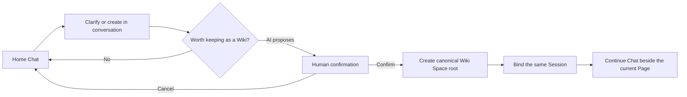

# 一人 AI Wiki 产品 Brief

状态：active product contract
更新时间：2026-08-23
关联文档：[产品北极星](../chengxing-product-north-star.md) · [系统模型](../../SYSTEM.md) · [重构约束](../../CONSTRAINTS.md)

## 一句话定位

成形是一个 Web-only 的一人团队 AI Wiki：一个 human owner 先和助手对话，在内容值得长期维护时显式创建
Wiki Space，再与多个 AI Agents 一起把它发展成可审阅、可版本化的 Pages。

## 为谁解决什么问题

目标用户不是一个等待分工协作的多人团队，而是一个需要借助 AI 扩展认知和执行能力的个人。这个人通常
同时做研究、写作、规划、产品设计或轻量开发，真正的问题不是“缺一个项目管理系统”，而是：

- 想法先以对话出现，但有价值的结果很难自然沉淀为长期知识；
- 文件、对话、版本和 AI 工作分散，后续无法沿着原上下文继续；
- AI 可以快速生成内容，却容易越权改写、覆盖或产生不可追溯结果；
- 高级 Agent/Job/Git 能力很强，但不应成为每次打开产品时必须理解的前置概念。

## 固定产品拓扑

```text
1 singleton Organization
└── 1 human owner
    ├── N AgentProfile (AI collaborators)
    └── N Wiki Space
        └── N Page
```

- `Organization` 是本地隔离边界，不是可切换 tenant。
- human owner 是唯一拥有最终 apply/approve 权限的人。
- 多个 `AgentProfile` 是 AI 协作者，不是多人登录中的成员。
- 当前产品不提供或宣称 multi-user、login、invite、provisioning、SSO。

## 核心对象

### Wiki Space

Wiki Space 是用户理解中的知识/工作容器，也是 canonical Project root 的产品 facade。它拥有稳定身份、
Page tree、默认 Chat、支持资料、版本与上下文边界。一个 Wiki Space 可以是长期知识域，也可以是有明确
完成点的主题空间；无需再引入“项目”和“知识库”两套主概念。

### Page

Page 是 `Document` 的产品 facade，是 owner 与 AI 实际阅读、编写、评论、评审和版本化的内容单元。根 Page
可作为 Wiki Space 首页，其他 Pages 可以形成树。内部的 file/render adapter 可以支撑 document、web、slides
等呈现，但这些是 Page 的渲染形态，不是另一层“交付物”。

### Chat

Chat 是默认入口和最轻的工作方式。首页 Chat 可以回答问题、澄清目标、研究和形成草稿，但不会仅因一条
消息就创建 Wiki Space。Chat Session 是连续上下文：当 owner 确认创建 Wiki Space 时，新空间接管同一个
Session，用户不需要重新解释，也不会得到一份复制出来的聊天历史。

### Advanced

Room、Agents、Team Tasks、Execution Jobs 和 Git Knowledge 收拢在 Advanced 下：

- **Room**：需要多个专业 Agent、typed mention、grant 或 tool confirmation 时使用；
- **Agents**：查看和配置 Organization 内的 AI `AgentProfile`；
- **Team Tasks / Jobs**：处理显式分派、长跑、可恢复和隔离执行；
- **Git Knowledge**：管理 Agent/Runtime 使用的 Git-backed 知识、建议变更、人工 merge 和 ready snapshot。

Advanced 能力不会改写默认 Chat，也不会成为创建 Wiki Space 的必要步骤。

## Git Knowledge 不是 Wiki

这两个对象服务不同读者、事实源和写入流程：

| 维度 | Wiki Space | Git `KnowledgeSpace` |
| --- | --- | --- |
| 主要读者 | human owner 与日常助手 | Agent、Runtime 与高级审阅者 |
| 内容形态 | Pages、支持资料、评论、可见版本 | Git tree、commit、binding、snapshot |
| 默认入口 | Home / Wiki navigation | Advanced / Git Knowledge |
| 写入规则 | AI 准备 Suggested changes，human apply 到 Page draft | Runtime 准备建议分支，human approve，trusted worker CAS merge |
| 可见事实源 | 当前 Page draft 与可见 immutable versions | 已激活的 `ready` snapshot |

不得为了减少内部类型而把两者合并，也不得把 Git repository 直接展示成用户的 Wiki Space。

## 首页主流程



必须满足：

1. 首页输入框的主 CTA 是 **Ask Assistant**，不是 Create Project。
2. 普通 Chat 不产生空 Wiki Space、占位 Page 或隐藏 project root。
3. AI 可以建议 **Create Wiki Space**，但不能替 owner 确认。
4. 确认命令必须幂等；未知结果只重查同一 request。
5. 创建与 same-Session binding 必须原子或可确定恢复，不能出现有空间无会话、重复空间或消息复制。
6. 创建后继续展示同一对话，并把当前焦点落到 Wiki Space 首页 Page。

## Page 修改与人工控制

默认编辑闭环是：

```text
owner intent -> AI Suggested changes -> review/diff -> owner apply or discard -> trusted CAS mutation
```

- AI 准备的 Suggested changes 不修改 live draft。
- owner 必须能看到影响的 Pages/files、base revision 与预期结果。
- apply 同时校验 authority、revision/hash 和 Suggested changes 状态，失败无部分效果。
- comment-source edit 与一般 Suggested changes 复用同一 apply seam。
- milestone/recovery/version 继续属于 Page，不属于 Chat。
- Git Knowledge 走独立 suggest/approve/merge lifecycle，不能借 Page apply 越权合并。

## 信息架构

默认导航层级：

1. **Chat**：首页和 Wiki Space 内都可继续；负责目标、澄清和整体推进。
2. **Wiki Spaces**：列出 owner 的长期空间。
3. **Pages**：当前 Wiki Space 内的树、搜索和最近访问。
4. **Review / Versions / Support Material**：围绕当前 Page 的上下文能力。
5. **Advanced**：Room、Agents、Team Tasks、Jobs、Git Knowledge。普通流程不展示 runtime selector、
   lease/attempt、recovery 或 Git merge 控制台。
6. **Settings**：模型、搜索 provider、语言、存储与诊断。

低频对象管理（rename、move、delete、link）放在对应 Space/Page 的对象菜单，不进入 View。

## 可见术语

| 使用 | English | 中文 | 不再用于主路径 |
| --- | --- | --- | --- |
| 顶层容器 | Wiki Space | Wiki 空间 | Project / 项目 |
| 内容单元 | Page | 页面 | Deliverable / Content / 交付物 / 内容 |
| 默认助手入口 | Chat / Ask Assistant | 对话 / 问助手 | Project Room default |
| 高级多 Agent 面 | Room | 协作室 | 默认入口 |
| 高级 Git 知识 | Git Knowledge | Git 知识 | Wiki / Wiki Space |

内部 key、route、schema 为兼容可暂时保留旧名，但新 value、标题、CTA、empty state 和帮助文案必须遵守上表。

## 当前与非目标

当前必须保留的边界：

- Web-only，无 desktop/Electron runtime；
- trusted local single-user，无 production identity provider 或 login；
- OpenHands disabled/offline/capacity-zero/fail-closed；
- tldraw watermark 不隐藏，发布前另行解决许可证或条款决策；
- remote Git credentials/fetch/push 和 monorepo subpath mount 不在当前范围。

当前非目标还包括：多人 Wiki 协作、实时共同编辑、邀请、角色管理 UI、公共发布平台、把 Advanced 全部
搬到首页，以及把 Git Knowledge 伪装成普通 Wiki Pages。

## 验收标准

- 新用户打开产品先看到 Ask Assistant；发送消息后数据库中没有新增空 Wiki Space。
- AI 建议创建后，未确认不产生空间；确认一次只产生一个 canonical root。
- 创建前后的 Session ID 相同，原消息顺序、附件和来源可追溯。
- 主路径英中文案使用 Wiki Space/Page，不出现 Project/Deliverable/Content 作为对象名称。
- owner 可以拥有多个 Wiki Spaces，每个空间可创建、查找、移动和版本化多个 Pages。
- AI Page Suggested changes 在 apply 前不改 live draft；只有 owner 能确认 apply/discard。
- 默认导航显示 Chat、Wiki Spaces、Pages；Room/Agents/Tasks/Jobs/Git Knowledge 位于 Advanced。
- Git Knowledge 页面明确说明其不是 Wiki，并继续执行 human-approved trusted CAS merge。
- UI、文档和测试不宣称 multi-user/login；Web-only、OpenHands 和 tldraw 边界仍可见。

## 分阶段交付

1. **术语与文档**：冻结 facade、首页流程、默认/高级分层；迁移 i18n values。
2. **Home Chat**：实现无 Wiki 的 Session 与聊天主页；证明普通消息不创建空 Wiki。
3. **Explicit create**：增加 AI 建议、owner confirmation、幂等 canonical root 创建与 same-Session adoption。
4. **Wiki navigation**：把历史 Project/Node 表面迁为 Wiki Space/Page，保持底层兼容。
5. **Advanced disclosure**：收拢 Room、Agents、Tasks、Jobs、Git Knowledge，并更新回归测试。
6. **同树完整门禁**：在文案、行为与测试冻结后运行 `npm run verify:iteration`，新增 dated record；不得
   复用历史 Project Room gate 数字证明本 workstream。
