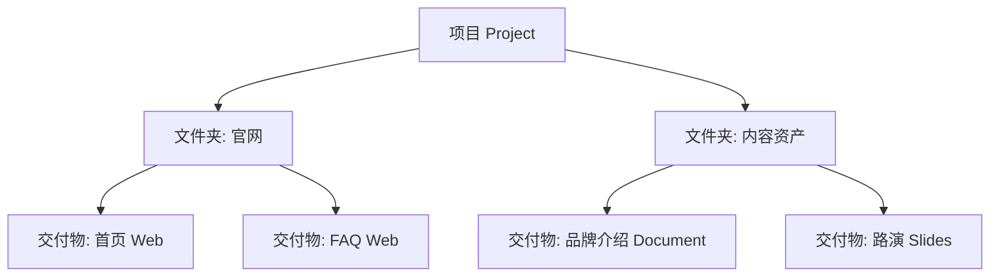
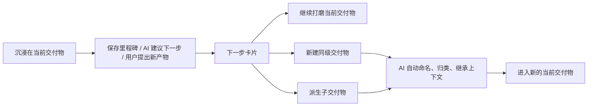
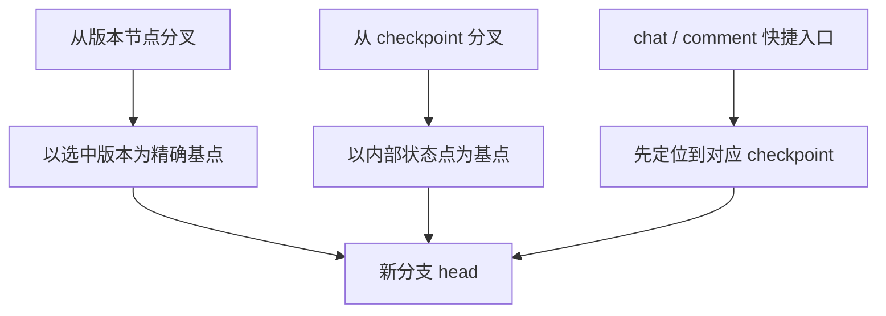
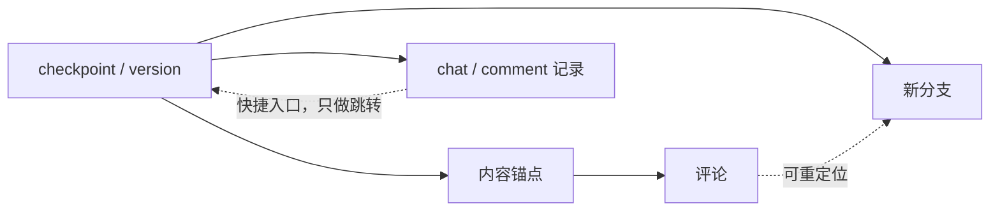

# 成形产品北极星设计文档（讨论稿）

更新时间：2026-03-13
状态：讨论稿，用于后续产品和交互收敛；在关键边界未定前，不把它当成已实现事实。

## 文档目的

这份文档不是需求清单，也不是开发任务拆解。
它的作用是给成形当前阶段提供一份统一的产品北极星，先把专有名词、主对象、模块边界和关键交互语义说清楚，再据此讨论界面与实现。

## 指导原则

`怀揣梦想，脚踏实地`

在成形里的具体含义是：

- 怀揣梦想：产品长期目标要敢于对准“数字世界入口”“超级 agent”“自然语言编程”“发布与运维自动化”这些高天花板能力。
- 脚踏实地：每一轮迭代都先把当前主对象、当前交互闭环、当前用户可感知状态做扎实，不拿远期愿景掩盖今天的术语混乱、对象错位和半成品体验。
- 两者同时成立：长期模型要提前写进文档，短期实现要分阶段收敛，不做虚假的“已经支持”，也不因为当前实现简陋就把愿景降没了。

---

## 现状

成形当前已经具备一个 AI 原生创作工作区的雏形：

- 用户从目标出发创建一个工作区。
- AI 生成计划并推动第一稿。
- 用户可以在中间交付物上阅读、编辑、评论、对话、保存版本、预览结果。
- 右侧已经形成 `计划 / 评审 / 对话 / 上下文` 四个助手面板。

但当前产品边界仍然处于混合状态：

- `项目 / workspace / wiki / deliverable` 在产品语言和数据模型里仍有重叠。
- `分支` 在界面语言上像“另一条产出路径”，当前实现上更接近“同一交付物上的另一条会话”。
- `支持资料` 与 `上下文` 都在表达“给 AI 的附加信息”，心智边界不清。
- `知识 / 记忆 / 稳定产出的方法` 还没有完全分层。
- `大纲 / 评论历史 / AI 状态 / 删除入口 / 语言设置` 这些交互都有入口，但闭环程度不一致。
- `多交付物项目 / 树状版本管理 / 网页预览评论 / iPad 形态 / 文档分发` 这些长期目标已经出现，但产品模型还没完全承接。

当前代码层的真实边界可以先记一条：

- 现在的主对象实际上是 `单交付物工作区`，而不是 `一个项目下多个交付物`。

---

## 目标

成形要成为一个以交付物为中心的 AI 原生创作工作台，让用户在一个项目内组织多个交付物，但在任意时刻始终聚焦当前活跃交付物，并围绕它持续规划、起草、评审、分叉、沉淀上下文、发布和运维。

北极星目标拆成 8 条：

- 交付物始终是屏幕上的第一对象，不让文件系统和内部运行机制抢占主叙事。
- 一个项目可以包含多个交付物，但编辑态只允许一个 `当前交付物` 占据中心舞台。
- 每个核心名词只承担一种职责，避免 `版本 / 分支 / 评论 / 上下文` 互相越界。
- 用户在费力调教出高质量结果后，能够把“稳定产出的方法”沉淀下来并复用，而不是每次重新从大解空间里碰运气。
- 版本体系要服务于 `树状结构版本管理`：任意分叉、任意比较、任意回滚。
- 网页类交付物的评审必须发生在预览表面，而不是退化成源码审阅。
- slides 作为文档与网页之间的混合交付物，需要沿用同一模型，而不是单独发明另一套产品。
- 代码交付物长期要走 `自然语言 -> 代码` 的自然语言编程模式，而不是把成形做成 IDE。
- AI 是推进主循环的主体，手动操作是兜底和精修，不是主故事。
- 用户能在任意时刻回答 3 个问题：我现在看的是什么、AI 正在做什么、下一步我该做什么。
- 所有关键交互都必须闭环，不能出现“看起来能用，但实际不生效”的半成品状态。
- 长期上，成形要成为用户数字世界的入口，让浏览、编辑、发布、运维逐步被 AI 自动化接管。

---

## 差距

当前产品距离北极星，主要差 4 个边界：

### 1. 主对象边界还不稳

- 用户看到的是“项目”，但系统当前更像“单交付物工作区”。
- 一旦继续引入多交付物、分支、版本树，这个边界不清就会持续制造错配。

### 2. 术语边界还不稳

- `支持资料` 与 `上下文` 仍有角色重叠。
- `知识 / 记忆 / 工作流方法` 还没有彻底分层。
- `分支` 的命名承诺和真实行为不一致。
- `历史记录`、`版本`、`回退点` 的产品含义还没有完全定死。

### 3. 模块边界还不稳

- 左侧边栏同时承担项目管理、交付物导航、支持资料展示，但对象层级还没完全理顺。
- 右侧助手栏已经有四个 tab，但各自的数据来源和用户预期尚未统一。
- 各类交付物的主审阅表面仍未统一：document 偏正文，web 偏预览，slides 还没有明确方案，code 长期模型尚未固化。

### 4. 交互闭环还不稳

- 评论 resolve 后的流转体验不够即时。
- 大纲点击没有形成真正导航。
- AI 运行态暴露了太多“内部思考氛围”，不符合产品语言。
- 低频设置和高频对象操作被放在了不合适的位置。
- 预览评论、分支切换、版本树浏览、跨交付物切换等关键交互还没有共同语义。

---

## 执行计划

### 1. 先冻结术语和对象模型

先把文案、交互和实现都围绕同一套词汇对齐：

1. 明确 `项目`、`交付物树`、`当前交付物`、`工作区` 之间的关系。
2. 明确 `版本树`、`分支`、`评论`、`上下文`、`工作流沉淀` 的职责边界。
3. 明确哪些是全局设置，哪些是项目状态，哪些是当前交付物状态。

### 2. 再冻结页面信息架构

把当前工作区固定为三栏心智：

1. 左侧：对象导航
2. 中间：当前交付物
3. 右侧：AI 助手系统

任何新功能都必须先回答它属于哪一栏，不能跨栏漂移。

### 3. 最后再处理具体交互问题

在边界清楚后，再逐个处理：

1. 评论 resolve 与历史记录
2. 支持资料与上下文
3. 大纲导航
4. 多交付物项目与注意力保持
5. 版本树与分支语义
6. 网页预览评论与 slides 审阅面
7. AI 运行状态表达
8. 对象菜单与全局设置入口
9. iPad 与文档分发

---

## 验收标准

这份北极星文档有效，至少要同时满足团队侧和用户侧两组可观察条件。

### 团队侧

- 团队内部能用同一套术语描述当前产品，而不需要在 `project / workspace / wiki / deliverable` 之间反复翻译。
- 每个核心名词都能用一句产品语言说清楚它是什么、它不是什么。
- 团队能说清“一个项目多个交付物”和“当前只聚焦一个交付物”为什么不矛盾。
- 新功能讨论时，能够先归入已有模块，而不是临时找入口塞进界面。
- 用户层面不会再出现“这个按钮看起来像 A，实际却是 B”的命名错配。
- 后续 UI 调整能围绕本文件讨论，而不是围绕单个截图的局部意见反复横跳。

### 用户侧

- 在不看帮助文档的前提下，用户在 5 分钟原型走查内能回答：我现在看的是什么、AI 正在做什么、下一步我该做什么。
- 用户能区分 `支持资料`、`上下文`、`评论`、`版本`、`分支` 的职责，而不是把它们都理解成“给 AI 的东西”。
- 用户调教出一次满意结果后，能够明确把它沉淀为可复用的方法，并在下一次复用时感受到更稳定的产出。
- 用户完成一次修改后，能明确说出这次改动是 `待审修改` 还是 `已直接应用`，并知道如何撤回。
- 用户切换交付物、切换版本、查看历史评论时，不会把当前对象和历史对象混淆。
- 至少一轮任务走查要覆盖 `document` 和 `web` 两类交付物，验证正文审阅与预览审阅都能被解释清楚。

---

## 专有名词表

下面的定义以产品语言为准，不以当前代码命名为准。

| 术语 | 定义 | 不是什么 | 当前状态 |
| --- | --- | --- | --- |
| 项目 Project | 一组围绕同一目标的创作容器。长期上可以包含多个交付物。 | 不是单次对话，也不是单个版本。 | 待定。当前实现更接近单交付物工作区。 |
| 交付物树 Deliverable Tree | 项目内多个交付物的组织结构，可按页面、章节、子系统或产出物分组。 | 不是版本树。 | 北极星目标，尚未实现。 |
| 工作区 Workspace | 用户当前操作的具体工作现场，是“项目上下文 + 当前交付物”的合成操作面。 | 不是全局设置页。 | 已存在，但当前更接近单交付物工作区。 |
| 交付物 Deliverable | 用户真正想产出的成果，如文档、网页、代码交付物、幻灯片。 | 不是聊天记录，不是文件树本身。 | 已存在，应继续作为核心对象。 |
| 交付类型 Deliverable Type | 交付物的工作形态，如 document、web、code、slides。 | 不是版本，也不是模板主题。 | 已存在。 |
| 草稿 Draft | 当前仍可继续修改的工作版本。 | 不是正式里程碑。 | 已存在。 |
| 版本树 Version Tree | 围绕同一交付物形成的可分叉、可回滚、可比较的版本图。 | 不是项目树，也不是会话树。 | 北极星目标，尚未实现。 |
| 版本 Version / 里程碑 Milestone | 用户认为值得比较、恢复、引用的正式节点。 | 不是 AI 每一步内部回撤点。 | 已存在，但需要继续强化“正式版本”含义。 |
| 回退点 Recovery Point | 系统在 AI 输出或应用变更前后自动保留的快速撤回位。 | 不是用户面对的正式版本。 | 已存在，需继续弱化其用户可见性。 |
| 分支 Branch | 从任意版本节点继续长出的交付物版本支线。 | 不是单独的聊天叉线。 | 北极星目标。当前用户看到的 branch 与真实行为不完全一致。 |
| 对话 Chat / Conversation | 用户与 AI 围绕当前交付物的连续交流。 | 不是交付物本身。 | 已存在。 |
| 评论 Comment | 锚定到局部内容的精确修改请求。 | 不是普通闲聊，也不是版本说明。 | 已存在。 |
| 评审 Review | 对交付物当前状态进行局部检查、评论、追问和应用建议的过程。 | 不是通用聊天页。 | 已存在。 |
| 支持资料 Support Material | 用户上传给当前工作区的原始输入材料，如文件、图片、摘录、网页内容。 | 不是 AI 已提炼好的知识。 | 已存在。 |
| 上下文 Context | 当前工作区可被 AI 复用的辅助认知层，包括知识卡片、记忆、后续可扩展的提炼结果。 | 不是原始上传区。 | 已存在，但与支持资料边界不清。 |
| 知识卡片 Knowledge | 用户或系统沉淀下来的可复用事实、背景、约束说明。 | 不是原始附件。 | 已存在。 |
| 记忆 Memory | 从评审和历史互动中提取的长期偏好、纠偏、领域约束。 | 不是每条评论的原文。 | 已存在。 |
| 工作流沉淀 Workflow Playbook | 用户调教出来的稳定产出方法，包括步骤、约束、检查标准、交付骨架和偏好的工作顺序。 | 不是原始资料，不是单条记忆，也不是某一次具体版本。 | 北极星目标，当前先做本地沉淀。 |
| 计划 Plan | AI 把目标拆成阶段并公开当前推进状态的结构化表示。 | 不是长篇推理展示。 | 已存在。 |
| 预览 Preview | 可直接检查当前交付物运行结果或渲染结果的可视表面。 | 不是源码视图。 | 已存在，主要对 web / code 更重要。 |
| 预览评论 Preview Comment | 发生在渲染结果上的评论，可挂到节点、容器、组件或可见区域。 | 不是只能对源码 range 留言。 | 北极星目标，web 应优先支持。 |
| 待审修改 Staged Changes | AI 已准备好、但尚未并入当前草稿的改动集合。 | 不是正式版本。 | 已存在。 |
| 自然语言编程 Natural Language Programming | 以自然语言目标、行为和结果为主表面，由 AI 生成并维护代码实现的工作模式。 | 不是 IDE-first 的写代码流程。 | 长期方向，当前不做完整承诺。 |

---

## 整体目标与非目标

### 整体目标

- 让用户从目标开始，而不是从空白文件开始。
- 让一个项目能够承载多个交付物，而不破坏用户对当前交付物的持续专注。
- 让 AI 直接参与起稿、修改、解释和推进，而不是只做问答。
- 让评审和版本管理围绕交付物本身展开，而不是围绕聊天记录展开。
- 让支持资料、上下文、历史版本和当前草稿都能被 AI 统一利用。
- 让用户可将成功调教出的工作流沉淀为可复用 playbook，从“偶然产出”走向“稳定产出”。
- 让数字产物后续的发布、运行、运维逐步回收到同一工作空间，由 AI 自动化接手更多细节。
- 让桌面端与 iPad 最终都能承担“数字世界入口”的角色。

### 当前阶段非目标

- 不把成形做成通用 IDE。
- 不把对话历史当成产品主界面。
- 不向用户暴露大量 agent 内部过程、系统提示词或 transport 细节。
- 不在对象模型尚未稳定前，急于堆更多功能入口。
- 当前阶段不承诺完整发布运维平台，只把它写进长期方向。
- 当前阶段不承诺完整自然语言编程体验，代码交付物先标记为后续能力。

---

## 产品主对象与层级

### 北极星层级

推荐的长期层级是：

`项目 Project -> 交付物树 Deliverable Tree -> 当前交付物 Deliverable -> 版本树 Version Tree -> 评论 / 对话 / 上下文 / 预览`

这个层级意味着：

- 项目负责组织
- 交付物树负责结构
- 当前交付物负责产出
- 版本树负责可分叉演进
- 对话负责推进
- 评论负责局部修订
- 上下文负责辅助理解
- 工作流沉淀负责约束 AI 的解空间与产出方式
- 预览负责直接审阅结果

### 当前阶段层级

当前实现更接近：

`工作区 Workspace(单交付物) -> 文件 / 草稿 / 版本 / 评论 / 对话 / 上下文`

因此短期内建议：

- 产品文档先承认当前真实边界，不假装已经支持一个项目多个交付物。
- 如果 UI 继续使用“项目”这个词，需要明确这是“单交付物项目”的阶段性形态。
- 真正的多交付物项目，作为后续架构升级单列决策，不与当前交互优化混在一起。

### 当前阶段术语迁移规则

为避免长期语义和当前实现继续混用，建议按下面的阶段迁移：

1. 当前单交付物阶段，编辑态优先使用 `工作区` 与 `当前交付物`；如果首页暂保留 `项目`，必须明确它只是阶段性容器名，不暗示已经支持交付物树。
2. 多交付物落地前，`project` 可以保留为内部技术名或列表层命名，但不应该承担解释中央编辑行为的用户文案。
3. 真正支持交付物树后，再把 `项目` 升格为用户可见一级对象；同时把 `workspace` 收敛为“项目中的当前交付物工作现场”。
4. 每次术语升级必须同步改创建流、首页列表、空状态、设置与帮助文档，不允许同一版本并存两套主叙事。

### 多交付物项目的注意力原则

支持多个交付物，不等于让屏幕同时服务多个交付物。

北极星原则是：

- 一个项目内可以有多个交付物。
- 任意时刻只允许一个 `当前交付物` 占据中央主表面。
- 其他交付物作为左侧结构导航存在，而不是和当前交付物争夺注意力。
- AI 的计划、评审、对话、上下文，默认都绑定到当前交付物；只有在明确切换时才跨交付物。
- 交付物之间允许引用、继承和生成子交付物，但不混成一个页面里的多中心编辑。

### 交付物树的用户表面

用户感知上，交付物树可以非常接近普通文件夹树。

推荐做法：

- 用户可见节点先只保留两类：`文件夹 Folder` 与 `交付物 Deliverable`
- `文件夹` 只负责组织与命名，不承担版本、评论、预览、发布
- `交付物` 是叶子节点，才拥有草稿、版本树、评论、对话、上下文和预览
- AI 可以建议树结构、自动归类、自动命名，但用户始终可以改名、拖动、重组
- 视觉上像文件夹树，语义上仍然是“项目中的多个产物”，而不是一套普通文件系统

这样既保留熟悉度，也避免把“章节 / 页面 / 产物 / 文件”混成同一层。

### 从当前交付物自然切出，而不打断沉浸感

这里的重点不是“标准”，而是“转场”。

推荐原则：

- 用户大多数时间停留在当前交付物里，不被项目树频繁打扰
- 只有在一个自然节点，系统才邀请用户长出下一个交付物
- “下一个交付物”不是从空白开始，而是从当前交付物和当前项目上下文中派生

适合触发切出的时机：

- 用户保存了一个里程碑
- AI 判断当前产物已经稳定，并建议配套产物
- 用户明确说“基于这个再做一个……”
- 用户在右侧计划里进入下一阶段，需要新的产物承接

推荐入口：

- 当前交付物保存成功后的下一步卡片
- 当前交付物标题栏旁的 `+ 派生`
- 左侧树节点的 `新建同级交付物 / 新建子交付物`

推荐动作文案：

- `继续打磨当前交付物`
- `新建同级交付物`
- `从当前交付物派生子交付物`
- `基于当前内容生成第一稿`

---

## 核心用户主流程

### 1. 从目标开始

- 用户选择交付类型
- 用户描述目标、约束、风格
- AI 生成计划
- AI 起第一稿

### 2. 围绕交付物迭代

- 用户阅读当前草稿
- 用户通过评论或对话提出修改
- AI 生成待审修改或直接更新草稿
- 用户在预览或正文中确认结果

### 2.1 AI 改动提交策略

为了不破坏信任模型，AI 改动默认分两条路径，但边界必须固定：

- 默认进入 `待审修改 Staged Changes`：适用于结构调整、批量改写、删除内容、跨文件或跨页面变更、影响预览或运行结果的改动，以及用户明确要求“先给我看方案”的场景。
- 允许直接更新草稿：只适用于低风险、局部、用户意图明确的机械性改动，如错别字修正、局部润色、格式整理；且前提是用户已明确授权自动应用。
- 任何直接更新草稿的动作，都必须先自动创建 `Recovery Point`，再用明确状态告诉用户“已自动应用，可立即撤回”。
- `里程碑版本` 仍只由用户主动保存，AI 不自动创建正式里程碑。
- 系统无法判断风险时，一律退回 `待审修改`，而不是静默改正文。

### 3. 保存正式节点

- 当某一阶段稳定后，用户保存为里程碑版本
- 版本用于比较、恢复和对外引用
- 回退点只承担系统撤回，不承担正式历史叙事

### 4. 沉淀长期上下文

- 支持资料提供原始素材
- 评论和对话沉淀知识卡片与记忆
- 后续轮次由 AI 自动复用这些上下文

### 4.1 沉淀稳定工作流

AI 能力很强，但解空间太大，不代表它会持续稳定地产出用户真正想要的结果。

因此成形必须支持把“用户调教成功的方法”沉淀下来。

推荐规则：

- 当用户通过多轮修改、评论、回滚、对比，最终得到满意结果后，允许把这套方法提升为 `Workflow Playbook`
- Playbook 不是保存某一版内容，而是保存“怎么得到这类内容”
- Playbook 至少可以包含：
  - 目标类型与适用范围
  - 推荐步骤顺序
  - 必须遵守的约束
  - 常见风险与检查项
  - 交付结构骨架
  - 偏好的评审与提交策略
- Playbook 可以作用在：
  - 新项目
  - 新交付物
  - 当前交付物的下一轮任务
- 当前阶段先做 `本地沉淀`
- 终态上可以支持 `分享 / 导出 / 团队复用`，但不把分享能力作为当前落地前提
- 用户必须能编辑、禁用、复制、升级和废弃 playbook

这层能力是成形价值的重要组成部分。否则用户每次都在重新驯化 AI，平台只能提供“可能产出”，无法提供“稳定产出”。

### 4.2 Workflow Playbook V1 规格

V1 只解决一件事：

- 把用户已经调教成功的方法，本地保存下来，并在下次任务里稳定复用

V1 不解决的事：

- 团队协作分发
- 公开市场 / 模板广场
- 权限、审批、订阅分发

#### 1. 如何创建

V1 推荐只保留两种创建方式：

- `手动创建`
  - 入口放在 Context / Workflow 区域
  - 用户可以从空白开始写一个方法
- `从成功交付提炼`
  - 当用户保存里程碑、完成交付或显式确认“这次结果满意”后，系统建议“沉淀为工作流”
  - 系统先生成一份 playbook 草稿，用户确认后再保存

V1 不建议：

- 每次任务自动生成 playbook
- 不经用户确认就直接把历史对话沉淀成方法

#### 2. 存哪些字段

V1 字段尽量小而稳，先保证可解释和可编辑：

- `id`
- `name`
- `scope`
  - `local_user`
  - `local_project`
  - `local_deliverable_type`
- `status`
  - `draft`
  - `active`
  - `archived`
- `summary`
- `applicableDeliverableTypes`
- `recommendedSteps`
- `requiredConstraints`
- `structureSkeleton`
- `reviewChecklist`
- `submissionStrategy`
  - 默认倾向 `staged_changes`
  - 是否允许低风险自动直改
- `sourceRefs`
  - 关联的版本、评论线程、对话轮次、计划快照
- `createdAt / updatedAt / version`

V1 不必存太多模型级细节。
例如 provider、具体 model、温度参数，不建议先做成 playbook 主字段。

#### 3. 在哪里选择复用

V1 只放 3 个高价值入口：

- `新项目 / 新交付物创建时`
  - 允许选择一个本地 playbook 作为起始方法
- `当前交付物下一轮任务前`
  - 在 Plan 区或对话输入附近切换“本轮沿用哪个 playbook”
- `完成一个交付物后开启下一个时`
  - 在“下一步卡片”里直接选择“沿用某个方法创建下一个交付物”

V1 不建议：

- 把 playbook 选择塞进全局设置
- 在太多零碎入口同时暴露 playbook

#### 4. 怎么从一次成功交付里提炼出来

推荐流程：

1. 用户保存一个满意的里程碑，或标记这次交付结果可接受
2. 系统基于以下来源生成草稿：
   - 当前计划
   - 被采纳的修改路径
   - 关键评论线程
   - 最终版本结构
   - 提交策略与回滚记录
3. 系统输出一份 `Playbook Draft`
4. 用户查看并编辑：
   - 这个方法适合什么类型任务
   - 哪些步骤是必须的
   - 哪些检查项要保留
   - 是否允许自动直改
5. 用户点击保存，本地生成一个可复用 playbook

#### 5. V1 的默认 UI 位置

推荐最小 UI：

- Context tab 下新增一个 `Workflow` 分区
- 每个 playbook 行支持：
  - 应用
  - 编辑
  - 复制
  - 归档
- 在成功交付后的下一步卡片中，出现 `沉淀为工作流` 动作

#### 6. V1 为什么有价值

V1 不是为了“模板很多”。
它是为了先解决一个非常具体的问题：

- 用户辛苦把 AI 调到一个稳定出结果的状态后，不需要下次再从头驯化一遍

也就是说，V1 先做“本地可复用的方法资产”，而不是做“可分享的工作流平台”。

### 5. 在项目内扩展交付物树

- 用户可以在同一项目中新增多个交付物
- 交付物可以按章节、页面、子系统或产出物组织成树
- 用户切换当前交付物时，中间主表面与右侧助手同步切换上下文

### 6. 围绕版本树分叉与回滚

- 用户可从任意版本节点继续分叉
- 每个分支都有自己的当前草稿 head
- 用户可以比较任意两个可见节点，并将当前工作头回滚到任意可恢复节点

### 6.1 分叉只从 checkpoint 或版本发起

推荐规则：

- `从版本节点分叉`：直接从选中的可见版本节点长出新分支
- `从 checkpoint 分叉`：直接从系统保留的内部状态点长出新分支
- 用户可见里程碑仍只在版本系统中由用户主动保存；checkpoint 是系统级内部状态点，用于分叉、回滚、比较与锚点重定位
- chat / comment 可以提供“从这轮结果分叉”的快捷入口，但它们本身不作为分叉基点；点击后必须先落到对应 checkpoint，再完成分叉

这可以把“可重建的内容状态”和“解释这个状态的对话/评论”彻底分开，不再把 chat branch 和 version branch 混成一件事。

---

## 模块与功能设计

### 1. 首页 / 项目列表

职责：

- 创建新的工作区
- 展示最近项目
- 进入已有项目

设计原则：

- 首页只解决“去哪里开始”。
- 不在首页暴露复杂版本、分支或上下文细节。

### 2. 工作区主壳

布局：

- 左栏：项目与交付物导航
- 中栏：交付物主表面
- 右栏：AI 助手栏

设计原则：

- 中间永远是主角。
- 左右两栏只服务于中间交付物，不单独抢主叙事。

### 3. 左侧边栏

包含：

- 项目列表
- 当前项目的交付物树
- 当前交付物大纲
- 支持资料
- 项目级低频操作菜单

设计原则：

- 左栏负责“定位对象”，不负责“推进流程”。
- 多交付物项目下，左栏首先承担“项目导航”和“交付物切换”。
- 大纲如果不能导航，就不应该展示成可点击对象。
- 删除、重命名等对象管理操作应该挂在对象行的 `...` 菜单中，而不是塞进 View。

### 4. 中央交付物区

包含：

- 当前草稿或版本内容
- 版本树切换、比较、分叉、保存
- 预览与实现视图切换

设计原则：

- 交付物内容优先于文件实现细节。
- 对 document 类型，默认看交付物正文。
- 对 web / code 类型，只在需要时展示实现面。
- 对多交付物项目，中间区永远只显示当前交付物，不拼盘展示多个兄弟节点。

### 5. 右侧助手栏

包含四个固定模块：

- 计划 Plan
- 评审 Review
- 对话 Chat
- 上下文 Context

设计原则：

- 四者都围绕同一交付物服务。
- Chat 只是助手系统的一个标签页，不是产品本体。
- Context 只放提炼层，不重复承担上传入口。

### 6. 计划模块

职责：

- 展示当前目标
- 展示阶段拆解
- 展示当前 AI 正在推进的阶段
- 必要时显示受阻原因和下一动作

设计原则：

- 展示“推进状态”，不展示冗长思维过程。
- 用户要一眼看出：AI 在做什么、为什么卡住、下一步能做什么。

### 7. 评审模块

职责：

- 管理进行中的评论线程
- 管理已解决评论历史
- 驱动局部修改、AI 回复、建议应用

设计原则：

- 评论是“写给 AI 的局部修改请求”。
- resolve 后线程应立即退出进行中列表，并进入历史。
- 已解决评论不应持续占用正文高亮，只在用户重新查看时聚焦。

### 8. 对话模块

职责：

- 围绕当前交付物发起整体性请求
- 解释选择、继续推进、改写结构、补充上下文

设计原则：

- 对话用于“全局推进”。
- 评论用于“局部修改”。
- 不把 AI 的内部推理包装成用户必须阅读的内容。

### 9. 上下文模块

职责：

- 呈现知识卡片
- 呈现可开关的 AI 记忆
- 呈现或链接可复用的工作流沉淀
- 后续可扩展为结构化参考上下文

设计原则：

- 上下文是“提炼层”，不是“素材仓库”。
- 原始上传继续留在支持资料区。
- 上下文里的每条知识或记忆都必须可追溯来源，并支持人工纠偏、禁用和失效标记。
- 工作流沉淀不能退化成一堆散碎记忆；它必须以“可复用方法”的形式存在。
- V1 推荐在 Context 下增加 `Workflow` 分区，而不是额外再开一个重量级主 tab。

### 10. 版本系统

职责：

- 创建正式里程碑
- 比较任意版本节点
- 从任意节点继续分叉
- 回滚到任意可恢复节点
- 管理系统回退点

设计原则：

- 里程碑对用户可见、可讲述。
- 回退点更多是安全机制，不是产品主叙事。
- 用户看到的 `Branch` 默认应该属于版本树，而不是聊天叉线。
- 对话是附着在当前交付物版本线上的推进手段，不是产品级主树。
- `Plan / Chat / Comment / Memory` 在分叉、比较、回滚后的附着关系必须先定义清楚，再进入版本树实现。

### 10.1 评论与分叉的挂载规则

评论挂载不能只靠“属于哪个会话”，必须同时绑定内容锚点与版本上下文。

推荐规则：

- 评论默认附着在 `当前交付物 + 当前分支 + 当前 checkpoint / 版本 + 当前内容锚点`
- 从版本节点精确分叉时：
  - 能在新分支基点成功重定位的未解决评论，继承到新分支
  - 无法重定位的评论，保留在源分支历史，不静默漂移
- 从 checkpoint 分叉时：
  - 以该 checkpoint 对应的内容状态为准尝试复制未解决评论
  - 能重定位的继承，不能重定位的留在源分支历史
- chat / comment 如果提供“从这轮结果分叉”快捷入口，只负责把用户带到对应 checkpoint；评论继承规则仍由 checkpoint 决定
- 已解决评论默认不复制，只在源分支历史保留
- 比较视图中，评论只做辅助标注，不替代版本差异本体

---

## 交付类型方案

### 1. Document

定位：

- 以结构化正文为主表面
- 大纲、评论、版本是主要工作方式

评审面：

- 正文选区评论
- 章节级导航
- 版本比较以文本和结构为主

### 2. Web

定位：

- 以预览结果为主表面，源码是次级实现面
- 用户始终围绕“我看到的网站结果”进行理解和修改

评审面：

- 评论优先挂载在预览中的节点、容器、组件或可见区域
- 评论语义是“改这个可见结果”，而不是“改某段源码”
- 必要时可以追溯到实现文件，但不把源码定位作为默认入口

锚点规则：

- 每条 `预览评论` 至少保存三层锚点：渲染节点稳定标识、语义区域路径、实现层回溯指针。
- 跨版本重定位时，先匹配稳定标识，再回退到语义区域路径，最后才使用实现层映射；三者都失败时，评论标记为“需要重新挂靠”，而不是静默漂移到别的节点。

版本面：

- 版本比较优先比较渲染结果与页面结构
- 对复杂站点，可按页面作为交付物树中的子交付物存在

长期方向：

- 网站不仅可在这里编辑，也可在这里浏览、检查、发布、维护

### 3. Slides

定位：

- slides 不是独立宇宙，它是 document 与 web 之间的混合体
- 既有叙事结构，也有可视页面

建议方案：

- 数据模型沿用交付物统一模型，不单独发明另一套对象体系
- 结构层使用 `deck -> section -> slide -> element / notes`
- 中间主表面以当前 slide 画布为主，同时保留左侧目录与缩略图导航
- 右侧评审可对整页 slide、单个元素、讲稿 notes 留评论
- AI 在 slides 中主要负责：叙事分段、页序安排、每页重点、讲稿补充、视觉意图说明

设计原则：

- 像文档一样保留结构化大纲
- 像网页一样允许基于视觉结果做评审
- 不把 slides 退化成“长文切页”

### 4. Code

定位：

- code 交付物长期要走“自然语言编程”路线
- 用户主表面看到的是目标、行为、运行结果、接口和系统能力，而不是一上来就面对源码

建议方案：

- 代码实现仍然存在，但默认放在实现面或次级视图
- AI 把自然语言目标转成架构、文件、代码和运行结果
- 对用户最重要的是“它做什么、如何验证、如何继续演化”，而不是文件树细节

当前结论：

- 这是长期方向，当前先标记为 `敬请期待`
- 在产品文档里先占位，不在当前阶段强行做半套 IDE

---

## 长期平台目标

成形的终极目标不是一个写作工具，而是用户未来数字世界的入口。

这意味着：

- 用户做出来的网站、文档、演示稿、自动化流程，后续都应该回到成形里继续浏览、编辑和演化。
- 发布、部署、运行、监控、回滚、维护等后续细节，应该逐步交给 AI 自动化处理。
- 用户主要停留在“目标、交付物、结果、风险、下一步”这个层级，而不是基础设施细节层级。
- 成形长期上应该是一个超级 agent 的工作台，而不是一个孤立的编辑器。

---

## 平台与设备策略

### 桌面端

- 继续作为当前主战场
- 完整承载多栏工作区、预览、版本树、项目导航等复杂能力

### iPad

- iPad 是明确的一等目标，不是降级兼容
- iPad 的魅力在于它天然适合“浏览结果 + 直接批注 + 快速指挥 AI”

设计原则：

- 任意时刻只保留一个 dominant surface
- 助手栏优先折叠为抽屉或侧滑面板
- 预览评论、正文评论、版本浏览必须适配触控与手写笔心智
- 不把桌面多栏原样硬压到 iPad 上

---

## 文档与帮助分发

开发期就要同步写文档，不等功能都做完再补。

分发策略：

- 产品文档持续维护在仓库内
- 后续发布到 GitHub Pages 作为公开使用说明与设计文档
- App 内置跳链到对应文档页面，作为“为什么这样设计 / 这个功能怎么用”的说明入口

同时必须坚持：

- 基本功能应当在不看文档的情况下就能上手
- 文档是澄清边界和复杂能力，不是替代基础交互设计

---

## 当前关键决策

下面这些不是已经拍板的事实，而是当前讨论最关键的收敛点。

### A. 项目与交付物的关系

建议：

- 明确支持“一个项目多个交付物”。
- 项目下引入交付物树，但中央主表面永远只显示一个当前交付物。
- `workspace` 在长期语义上应理解为“项目上下文中的当前交付物工作现场”。
- 术语迁移按“先承认当前单交付物工作区，再在多交付物落地时升格为项目”两阶段推进，不在一个版本里同时讲两套主叙事。

### B. 支持资料与上下文的关系

建议：

- `支持资料` = 原始输入材料
- `上下文` = 已提炼的知识、记忆与工作方法
- `支持资料 -> 上下文` 不是自动复制，而是带判断的提炼提升；只有跨轮仍有价值的事实、约束、偏好才进入 `知识卡片 / 记忆 / playbook`
- 每条 `知识卡片 / 记忆 / playbook` 都必须带来源指针，至少能回溯到原始文件、评论线程、对话轮次或版本节点之一
- 用户可以编辑、禁用、降级或删除任何提炼结果；人工纠偏优先于旧提炼结果
- 当原始资料被替换、删除，或版本回滚使前提失效时，相关 `知识卡片 / 记忆 / playbook` 必须被标记为“待复核”或自动重算，而不是继续静默生效

不建议：

- 把两者合并成一个模糊的大抽屉
- 在两个地方都同时出现上传入口
- 把“事实知识”和“工作方法”塞进同一类 memory 里，导致后续不可解释、不可控

### B.1 工作流沉淀的定位

建议：

- `Workflow Playbook` 单独作为“方法层”对象，不和 `Memory` 混为一谈
- `Memory` 负责偏好、纠偏、长期约束
- `Playbook` 负责步骤、骨架、检查清单、提交策略、推荐的评审方式
- Playbook 可以由用户手动创建，也可以在成功交付后由系统建议“提炼为稳定工作流”
- Playbook 需要版本化，因为用户的方法本身也会演进
- 当前先做 `本地沉淀`
- 终态可以支持 `分享 / 导出 / 团队复用`

推荐作用范围：

- 个人默认方法
- 项目方法
- 交付类型方法
- 某个具体交付物的派生方法

### C. 分支的语义

当前冲突：

- 用户理解的分支：交付物从某个版本节点继续长出另一条版本线
- 当前实现的分支：从某条消息复制一段会话历史，继续在同一工作区上聊天

建议：

- 用户可见的 `Branch` 默认定义为 `交付物版本分支`
- 当前 chat fork 若继续存在，应降级为“另开对话”或内部对象，不再占用 branch 这个词
- 对话默认附着在当前交付物分支 head 上
- 用户若要“从精确历史状态分叉”，入口只放在版本树与 checkpoint 历史里
- chat / comment 最多只提供“从这轮结果分叉”的快捷壳，点击后仍落到对应 checkpoint

补充的生命周期矩阵：

| 对象 | 默认附着边界 | 分叉时 | 回滚时 | 比较时 |
| --- | --- | --- | --- | --- |
| 计划 Plan | 当前交付物分支 head | 复制最近一次可见计划快照到新分支，后续独立推进 | 回到目标节点后重算当前状态，历史计划仍可追溯 | 版本比较不自动混入计划差异 |
| 对话 Chat | 当前交付物分支 head | 新分支默认开启新对话线程，并保留来源引用；chat 可作为快捷入口指向分叉基点，但不充当基点本身 | 不删除旧对话，但当前对话上下文切回目标节点所属线程 | 比较视图不把对话当主对象，只允许旁路查看 |
| 评论 Comment | 当前分支上的内容锚点，加所属 checkpoint / 版本上下文 | 仅继承能成功重定位的未解决评论；其余留在源分支历史 | 恢复目标节点时同步恢复该节点可见的评论状态 | 比较时只作为辅助标注，不替代版本差异本身 |
| 记忆 Memory | 工作区或项目级可复用上下文，带来源与适用范围 | 默认共享同一记忆池，不按分支复制；是否生效由适用范围控制 | 不随回滚自动删除，但需重新校验是否仍然适用 | 比较时不自动进入差异主表面 |
| 工作流沉淀 Workflow Playbook | 个人级、项目级或交付类型级方法层对象 | 默认不因分支自动复制；只有用户明确“从当前分支提炼新方法”才产生新 playbook | 不随回滚消失，但如果来源依据失效，需要提示复核 | 比较视图不自动进入差异主表面，可旁路查看“本次是否遵守 playbook” |

### D. 一个项目多个交付物

建议：

- 这是已经确认的目标，不再作为是否做的开放问题。
- 接下来真正要讨论的是交付物树如何组织，以及如何不破坏当前交付物焦点。
- 推荐先支持树状导航、单活跃交付物、交付物间引用，再讨论更复杂的批量视图。
- 用户表面上可以像文件夹一样管理交付物树，AI 负责建议命名、归类与派生位置。

### E. AI 运行状态的呈现

建议：

- 只展示产品级状态，如“正在规划下一步”“正在修改第 2 节”“等待预览启动”“需要配置 Provider”。
- 去掉 quote、哲思卡片、拟人化内部思考面板。

### F. 网页评论与 slides 方案

建议：

- web 交付物的评论默认挂在预览节点、容器、组件或页面区域上
- 预览评论进入实现前，必须先冻结稳定锚点模型与跨版本重定位策略
- slides 沿用统一交付物模型，按“结构化叙事 + 可视画布”混合方案设计
- document、web、slides 在对象模型上统一，在主审阅表面上区分

### G. 删除、重命名、语言设置与文档入口

建议：

- 删除、重命名属于对象管理，放在项目或交付物行的 `...` 菜单里。
- `View` 只保留当前页面呈现方式。
- 语言属于全局偏好，放在设置。
- 如果后续需要“当前会话语言”或“本轮回复语言”，那是局部工作区设置，不放在 View。
- 文档入口应同时出现在仓库、GitHub Pages 和 app 内跳链中。

### H. 一个交付物完成之后，在哪开启下一个

建议：

- 不回首页重开，而是在当前项目中自然长出下一个交付物
- 首选入口放在当前交付物完成态、保存成功态或 AI 下一步建议卡片中
- 同时在左侧交付物树节点菜单提供 `新建同级交付物 / 派生子交付物`
- 新交付物默认继承当前项目上下文，并允许 AI 自动命名、归类和起第一稿

### I. 稳定产出与工作流沉淀

建议：

- 这是核心价值，不是锦上添花
- 当用户经过多轮调教得到满意结果后，系统应主动建议“沉淀为可复用工作流”
- 后续新项目、新交付物、新分支都应允许选择既有 playbook 缩小 AI 解空间
- 当前阶段先做本地沉淀，先保证“我自己调出来的方法，下次还能稳定复用”
- 终态再支持分享，让个人方法可以升级为团队资产或公开模板
- 未来真正的竞争力，不只是“AI 能做”，而是“AI 能稳定按用户的方法做”

---

## 本轮已形成的交互原则

- 评论 resolve 后，立即进入历史；正文不再持续高亮。
- 历史评论只有在被重新选中时，才重新聚焦并短暂高亮。
- 大纲必须能导航，否则不展示为可点击条目。
- Chat 不展示冗长思考过程，只展示用户可操作的状态。
- 多交付物项目下，中央主表面只服务于当前交付物。
- 交付物树在用户表面上可以像文件夹树一样简单，但只有交付物节点拥有版本与评审能力。
- 用户可见的 branch 默认属于交付物版本树。
- 分叉只从 checkpoint / 版本发起；chat / comment 最多只提供快捷入口。
- web 评论优先挂在预览结果上，而不是源码上。
- slides 沿用统一交付物模型，不额外发明孤立系统。
- 完成一个交付物后，下一个交付物应在当前项目内自然派生，而不是把用户踢回首页。
- 稳定产出的方法必须能被沉淀成可复用 playbook，而不是散落在历史对话里。
- 删除与重命名属于对象菜单，不属于视图菜单。
- 支持资料和上下文必须分层，不允许继续用模糊文案混用。

---

## 后续讨论顺序建议

为了避免同时讨论太多问题，建议后续按这个顺序继续：

1. 先定 `项目 / 工作区 / 交付物 / 分支`
2. 再定 `交付物树 / 版本树 / 预览评论`
3. 再定 `支持资料 / 上下文 / 评论历史`
4. 再定 `slides / code / iPad / 文档分发`

---

## 备注

这份文档优先对齐产品语言和交互边界，不直接等同于当前数据库模型或组件结构。
如果后续实现与文档冲突，以“先回到这份文档讨论边界，再改实现”为原则。
