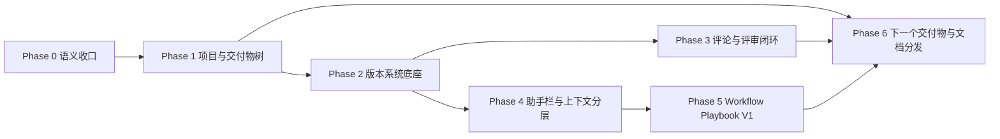

# 成形产品落地计划（防打架版）

当前执行状态见：[项目状态](./chengxing-project-status.md)

## 当前执行切片（2026-03-17）

状态：已完成。准备态、交付类型命名收口和渐进式首次引导均已落地。

### 现状

- 工作区在“还没启动第一稿”时，中央主表面和右侧状态栏都在使用接近“进行中”的语言和动画，导致用户一边看到“准备开始第一稿”，一边又还需要手动点一次启动。
- `交付意图` 这个名字已经不贴近用户心智；与此同时，部分模块展示名仍写死在组件里，没有统一走 copy/config 层。
- 中间主表面、顶部标题菜单和右侧状态栏都在重复解释“交付类型 / 当前阶段 / 下一步动作”，信息主家还不够干净。
- 首页 welcome modal 已降级为轻量起步提示；`Status / Review / Chat / Context / Workflow / Version` 的 contextual first-use guidance 已接回真实表面。

### 目标

- 把工作区收成一套更稳定的主叙事：未启动就是“准备态”，启动后才进入“进行态”；`交付类型` 成为统一可配置的展示名；状态入口只保留一个主家。

### 差距

- 当前最大的结构问题不是缺功能，而是“状态语义”和“动作入口”没有对齐：手动动作还在，但视觉已经提前像自动进行中。
- `交付意图` 这个名字背的是内部产品推导，不是用户最容易理解的说法；如果模块名继续写死，后续再做命名收口和渐进式引导会重复返工。
- 标题菜单里的第二个交付类型入口，和右侧 `Status` 面板形成概念重复，不符合“一种概念一个主家”。

### 执行计划

1. 把第一稿启动收成“手动启动前的准备态 + 手动启动后的进行态”，不再让未启动状态使用加载视觉。
2. 将交付物相关展示名统一改成 `交付类型`，并把标签、按钮、提示文案全部收回 copy 层。
3. 移除标题栏里的重复交付类型菜单，只保留右侧 `Status` 作为切换入口；中央主表面承担唯一的“生成第一稿”主动作。
4. 更新状态文档、经验台账和门禁用例，确保当前真实交互被验证，而不是继续验证旧文案或旧结构。
5. 把渐进式首次功能引导接回 `Status / Review / Chat / Context / Workflow / Version`，并把首页 welcome modal 降级为不阻断的轻提示。

### 验收标准

- 未启动第一稿时，中央主表面显示准备态和唯一主动作，不再默认显示“进行中”动画。
- 真正启动后，中央主表面和顶部状态胶囊才进入进行态动画。
- 右侧 `Status` 面板不再重复放置“生成第一稿”同主题卡片；交付类型切换仍保留在这里。
- 标题栏不再提供第二个交付类型菜单。
- `交付类型` 的模块标题、说明文案和切换提示全部走 copy 层。
- 首页不再用阻断式 welcome modal 承担 onboarding；只保留轻量起步提示。
- 首次打开 `Status / Review / Chat / Context / Workflow / Version` 时，会出现一次性的 contextual guide，而不是要求用户记住首页总说明。
- `npm run verify:iteration` 继续通过。

## 现状

北极星文档已经基本收敛了产品边界：

- 支持一个项目多个交付物，但中央主表面始终聚焦当前交付物
- 分叉只从 `checkpoint / version` 发起
- `chat / comment` 最多只提供通往对应状态点的快捷入口
- `支持资料 / 上下文 / Workflow Playbook` 已经分层
- web 评论优先挂在预览结果上，slides 沿用统一交付物模型

当前真正缺的不是再讨论一轮概念，而是一个不会互相打架的落地顺序。

如果没有阶段边界，最容易发生的冲突有三类：

- 一边改对象模型，一边先做 UI，最后按钮名字和真实行为又不一致
- 一边做分支，一边做评论挂载，最后锚点和版本基点对不上
- 一边做 Context，一边做 Playbook，最后“方法层”和“记忆层”重新混回去

## 目标

用最少的并行冲突，把北极星收敛成一条可连续交付的实现路径。

落地目标不是“一次做完终态”，而是按依赖顺序逐步建立 4 个稳定底座：

- 当前交付物主叙事
- 可重建的版本与分支基点
- 稳定的评论与评审闭环
- 可复用的本地工作流沉淀

## 差距

现在的问题不是模块太少，而是跨模块依赖太强：

- `项目 / 工作区 / 交付物` 的对象语义如果不先冻住，左栏、标题栏、创建流、下一步卡片都会反复返工
- `checkpoint / version / branch` 如果不先成为唯一可信状态基点，评论继承、回滚、比较、chat 快捷入口都会打架
- `Context / Memory / Playbook` 如果不先分层，后面做沉淀能力只会变成第二个杂物抽屉
- `Document / Web / Slides` 虽然对象模型统一，但评审表面不同，不能在一个阶段里混着硬做

所以这份计划强调两件事：

- 先定系统边界，再做界面皮肤
- 允许并行，但只在契约已经冻结之后并行

## 执行计划

### 1. 防打架总原则

1. 同一阶段只允许一个主叙事变化源。
   例如阶段 2 的主叙事是版本系统，就不要同时改写项目树语义。
2. 任何用户可见文案，必须晚于对象语义冻结。
   不允许 UI 先说“分支”，实现仍然只是复制会话。
3. 任何跨模块能力，必须先有附着基点。
   评论、比较、回滚、快捷分叉都先附着在 `checkpoint / version` 上。
4. `Context` 先做分层，再做增长。
   先把 `知识 / 记忆 / Playbook` 分开，再增加提炼与复用入口。
5. V1 只做本地闭环，不提前为分享、团队、发布市场付出复杂度。

### 2. 本轮不进入实现的范围

- `Code` 交付物的自然语言编程主表面
- Playbook 的分享 / 导出 / 团队分发
- 网站发布、运维自动化
- iPad 专项交互优化
- 模板市场、权限审批、组织级治理

### 3. 分阶段落地

#### Phase 0. 语义收口与假承诺清理

范围：

- 收口 `项目 / 工作区 / 交付物 / 分支 / checkpoint / version`
- 收口 `支持资料 / 上下文 / Memory / Workflow Playbook`
- 清理当前假承诺 UI 文案与入口

交付：

- chat 中的 `Branch from here` 改成 checkpoint/version 语义的快捷入口
- 大纲如果不能导航，就先不作为可点击对象出现
- 删除、重命名从 `View` 移回对象行菜单
- AI 推理态压缩成产品状态，不再展示过多内部过程

完成标志：

- 用户看见的名词，不再与真实实现明显冲突

不要并行做：

- 不要在这个阶段开始做新的分支树 UI
- 不要在这个阶段引入新的对象类型

#### Phase 1. 项目与交付物树

范围：

- 支持一个项目多个交付物
- 左侧建立“像文件夹树一样简单”的交付物树
- 中央继续只聚焦当前交付物

交付：

- `project -> folder -> deliverable` 的最小结构
- 当前交付物切换
- 新建同级交付物 / 派生子交付物
- 完成一个交付物后，在当前项目内自然开启下一个

完成标志：

- 用户不离开当前项目，也能连续产出多个交付物
- 中间主表面不会拼盘显示多个兄弟交付物

不要并行做：

- 不要在这个阶段碰版本树与评论继承
- 不要把 slides / web 特殊逻辑写死到树结构里

#### Phase 2. 版本系统底座

范围：

- 建立 `checkpoint / version / branch` 的真实数据与交互模型
- 让分叉、回滚、比较都围绕可重建的内容状态展开

交付：

- 用户可见版本节点
- 系统级 checkpoint
- 从 version / checkpoint 分叉
- 当前分支 head
- 比较与回滚的最小闭环

完成标志：

- 能明确回答“当前分支从哪个状态点长出来”
- chat / comment 的分叉快捷入口不再直接制造新的分支语义

不要并行做：

- 不要在这个阶段做预览评论重定位
- 不要在这个阶段扩充 Playbook

#### Phase 3. 评论与评审闭环

范围：

- 修正评论生命周期
- 建立评论和版本状态的附着关系
- 把 web 预览评论带进统一评审模型

交付：

- resolve 后立即移入历史
- resolved 评论默认取消正文常驻高亮
- 点击历史评论时重新聚焦并短暂高亮
- 文档评论锚点稳定化
- web 预览评论的三层锚点与跨版本重定位

完成标志：

- 评论不再漂在会话上，而是挂在 `交付物 + 分支 + checkpoint/version + 锚点`
- 分叉、回滚、比较后，评论行为仍可解释

不要并行做：

- 不要在这个阶段再改 branch 语义
- 不要同时尝试做完整分享协作评论

#### Phase 4. 助手栏与上下文分层

范围：

- 收口右侧 `Plan / Review / Chat / Context`
- 让四个模块围绕同一交付物工作

交付：

- Plan 只展示推进状态，不展示冗长思维过程
- Review 与评论生命周期对齐
- Chat 作为整体推进入口，不再冒充版本树
- Context 下完成 `知识 / 记忆 / Workflow` 的分区

完成标志：

- 用户能一句话说清每个 tab 的职责
- 右侧不再出现重复入口和概念重叠

不要并行做：

- 不要在这个阶段引入分享型知识库
- 不要把支持资料上传入口搬进 Context

#### Phase 5. Workflow Playbook V1

范围：

- 做本地可复用的方法层对象
- 让用户调教成功的方法能被保存和复用

交付：

- Playbook 本地数据模型
- `Context > Workflow` 列表与基础操作
- 从成功交付提炼 `Playbook Draft`
- 新项目 / 新交付物 / 下一轮任务 / 下一步卡片 选择 Playbook

完成标志：

- 用户辛苦调出来的方法，下次不需要重新驯化
- Playbook 与 Memory 不会混成一个抽屉

不要并行做：

- 不要在这个阶段做团队分享
- 不要引入模板市场或复杂权限

#### Phase 6. 交付物扩展与说明体系

范围：

- 在不破坏统一对象模型的前提下扩展交付类型体验
- 让产品说明、使用说明、设计说明形成一致入口
- 把 onboarding 从一次性欢迎弹窗升级为渐进式辅助引导

交付：

- web 交付物默认以预览为主表面
- slides 交付物按统一模型落地最小可用界面
- 仓库文档、GitHub Pages、app 内跳链三者打通
- “完成一个交付物后开启下一个”的导流卡片成型
- 首次打开 `Status / Review / Chat / Context / Workflow / Version` 等关键功能时，出现轻量的上下文引导，而不是只依赖全局 welcome modal
- 全局欢迎层只保留极轻的方向提示，不再承担所有功能教学

完成标志：

- document / web / slides 都遵守统一的版本、评论、上下文主模型
- 用户在产品内外都能找到同一套说明文档
- onboarding 变成“在真实场景里渐进提示”，用户不会因为错过第一次弹窗就失去功能引导

不要并行做：

- 不要提前扩到 code 终态
- 不要在这个阶段做 iPad 特化布局

### 4. 可并行与不可并行边界

| 能力域 | 可以开始的前提 | 可以与谁并行 | 当前不要与谁并行 |
| --- | --- | --- | --- |
| 项目与交付物树 | 语义收口完成 | 文档入口、对象菜单整理 | 版本树语义重做 |
| 版本系统 | 当前交付物模型冻结 | 助手栏状态压缩 | 评论重定位细节 |
| 评论与评审 | version/checkpoint 语义冻结 | 文档评论 UI、web 预览评论 UI | 分支语义重做 |
| Context 分层 | 支持资料与上下文边界冻结 | 助手栏信息架构 | Playbook 分享能力 |
| Workflow Playbook | Context 分层完成 | 新建交付物流程、下一步卡片 | 组织级模板市场 |
| 文档与说明体系 | 术语冻结 | 任意阶段的小步同步 | 依赖未定的功能说明 |

### 5. 推荐开工顺序

如果按“先止血，再搭底座，再长能力”的顺序推进，推荐这样排：

1. `Phase 0`
   清理假承诺，收口按钮和术语。
2. `Phase 1`
   先把一个项目多个交付物做出来，但主表面仍只盯当前交付物。
3. `Phase 2`
   让 `checkpoint / version / branch` 真正成为唯一可信状态基点。
4. `Phase 3 + Phase 4`
   在版本基点冻结后，可以并行做评论闭环和右侧助手栏收口。
5. `Phase 5`
   在 Context 分层稳定后，接上 Workflow Playbook V1。
6. `Phase 6`
   扩展 web / slides 与文档说明入口，把“连续创作”体验补完整。

## 验收标准

团队侧验收：

- 每个阶段都能说清“依赖什么、冻结什么、不和什么并行做”
- 评审时不再出现“UI 先承诺、数据层后来补语义”的返工
- 每个新入口都能挂回一个已经冻结的对象边界

用户侧验收：

- 用户始终知道自己当前在改哪个交付物、哪条版本线、哪一类上下文
- 评论、分叉、回滚、下一步创建都不会再互相打架
- 用户调出来的方法能在本地稳定复用
- 多交付物不会破坏“中央主表面始终聚焦当前交付物”的体验

本轮落地完成前，以下问题不应再反复摇摆：

- `Branch` 到底是不是 chat fork
- `Context` 里到底放不放素材
- “下一个交付物”到底回不回首页
- `Workflow Playbook` 到底算不算 Memory
